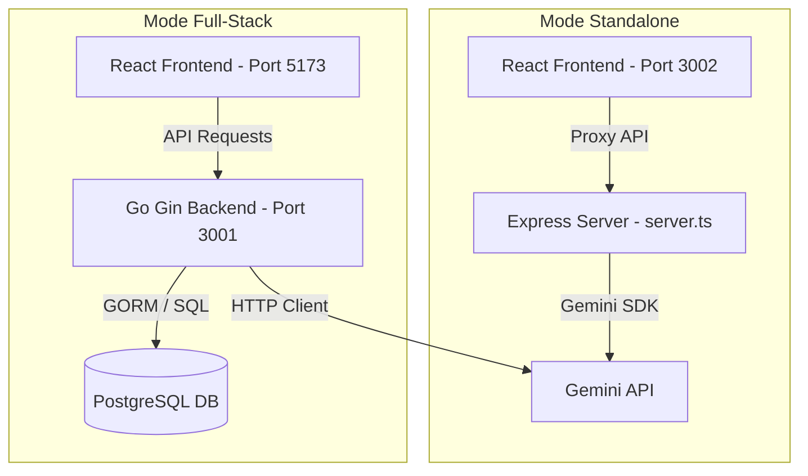

# Flowak 🌀
### AI-Powered Business Process Modeler & Technical System Architect

**Flowak** adalah platform kolaboratif modern berbasis graf untuk memodelkan proses bisnis dan merancang arsitektur sistem secara visual. Dengan dukungan **Gemini AI**, Flowak memungkinkan tim produk (Product Managers, UI/UX Designers, Frontend & Backend Engineers) untuk mentransformasikan deskripsi kebutuhan bisnis menjadi diagram alur kerja (workflow) yang kaya dengan detail teknis secara instan.

Aplikasi ini mendukung alokasi tugas teknis spesifik per langkah (node) untuk masing-masing peran fungsional:
*   🎨 **UI/UX**: Desain antarmuka, spesifikasi layar, & tautan prototipe.
*   💻 **Frontend**: Komponen React, rute halaman, framework, & integrasi API.
*   ⚙️ **Backend**: Endpoint REST, metode HTTP, skema database, & respons payload.

---

## 🏗️ Arsitektur & Mode Operasional

Flowak dirancang agar fleksibel dan dapat dijalankan dalam **dua mode operasional**:



### 1. Mode Standalone (Frontend + Express Proxy)
Mode ini sangat cocok untuk demonstrasi cepat (*offline-first* atau *sandbox*).
*   **Server**: Menggunakan Express (`frontend/server.ts`) yang berjalan pada port **3002**.
*   **Routing**: Menyajikan aset statis React + menangani proxy API untuk pemanggilan model Gemini.
*   **AI SDK**: Menggunakan `@google/genai` langsung dari Node.js.
*   **Penyimpanan**: In-memory atau local storage (tanpa dependensi database eksternal).

### 2. Mode Full-Stack (Go Backend + PostgreSQL + React)
Mode produksi komprehensif dengan dukungan SaaS (*multi-tenancy*), otentikasi, kolaborasi tim, dan persistensi data.
*   **Backend**: Ditulis dalam **Go** menggunakan framework **Gin-Gonic** (port **3001**).
*   **Frontend**: React 19 + Tailwind CSS v4 + Vite.
*   **Database**: **PostgreSQL** dengan migrasi skema ter-normalisasi secara otomatis.
*   **Fitur Lanjutan**: Manajemen organisasi/tenant, berbagi proyek (*project sharing*), Kanban Board, kalender jadwal, analitik performa, dan log perubahan modul.

---

## ⚙️ Panduan Konfigurasi

Kedua komponen (backend & frontend) menggunakan file `.env` untuk mengatur konfigurasi lingkungan masing-masing.

### 🔌 Konfigurasi Backend (`/backend/.env`)

| Variabel Lingkungan | Nilai Default | Deskripsi |
| :--- | :--- | :--- |
| `PORT` | `3001` | Port untuk menjalankan server Go Gin. |
| `APP_ENV` | `development` | Mode aplikasi (`development` atau `production`). |
| `JWT_SECRET` | `<YOUR_JWT_SECRET>` | Kunci rahasia JWT untuk otentikasi. Wajib diubah di produksi. |
| `GEMINI_API_KEY` | `<YOUR_GEMINI_API_KEY>` | Kunci API Gemini untuk fitur pembuatan alur teknis berbasis AI. |
| `ALLOWED_ORIGINS` | `http://localhost:5173,...` | Daftar origin CORS yang diizinkan (dipisahkan koma). |
| `DB_HOST` | `localhost` | Host server database PostgreSQL. |
| `DB_PORT` | `5432` | Port server database PostgreSQL. |
| `DB_USER` | `<YOUR_DB_USER>` | Username database PostgreSQL. |
| `DB_PASSWORD` | `<YOUR_DB_PASSWORD>` | Password database PostgreSQL. |
| `DB_NAME` | `flowak` | Nama database utama aplikasi. |

### 🎨 Konfigurasi Standalone Frontend (`/frontend/.env` atau `.env.local`)

| Variabel Lingkungan | Nilai Default | Deskripsi |
| :--- | :--- | :--- |
| `FRONTEND_SERVER_PORT`| `3002` | Port untuk Express Server dalam mode standalone. |
| `GEMINI_API_KEY` | `<YOUR_GEMINI_API_KEY>` | Kunci API Gemini untuk pemanggilan AI langsung via Express proxy. |
| `APP_URL` | `http://localhost:3002`| URL host tempat aplikasi ini dideploy (digunakan untuk callback/self-link). |

---

## 💾 Struktur Database & Skema Migrasi

Backend Go secara otomatis menjalankan migrasi dari file SQL yang terletak di `/backend/db/migrations/` saat startup. Skema yang dibuat meliputi:

1.  **`organizations` & `organization_members`**: Struktur *multi-tenant* SaaS untuk memisahkan ruang kerja antartim.
2.  **`users`**: Menyimpan kredensial pengguna terenkripsi, peran fungsional (`pm`, `uiux`, `frontend`, `backend`), dan log masuk.
3.  **`projects` & `project_members`**: Menyimpan ruang lingkup proyek dan tingkat akses kolaborator (`editor`, `viewer`, `owner`).
4.  **`modules`**: Representasi wadah dari satu diagram alur kerja.
5.  **`workflow_nodes` & `workflow_edges`**: Penyimpanan graf ter-normalisasi yang memisahkan data posisi visual ($x, y$) dan aspek bisnis/teknis.
6.  **`node_role_tasks`**: Pelacakan tugas per peran (`uiux`, `frontend`, `backend`) dengan status: `planned`, `in_progress`, `review`, `done`.
7.  **`node_uiux_specs`, `node_frontend_specs`, `node_backend_specs`**: Tabel spesifikasi teknis mendalam untuk masing-masing bidang implementasi.

---

## 🚀 Memulai Aplikasi

### Prasyarat
*   [Node.js](https://nodejs.org/) (Versi 18 ke atas)
*   [Go](https://go.dev/) (Versi 1.21 ke atas)
*   [PostgreSQL](https://www.postgresql.org/) (Jika menggunakan Mode Full-Stack)

---

### Cara 1: Menjalankan Mode Standalone (Express + React)

Sangat cepat, tanpa membutuhkan kompilasi Go maupun instalasi PostgreSQL.

1.  Masuk ke direktori frontend:
    ```bash
    cd frontend
    ```
2.  Pasang dependensi:
    ```bash
    npm install
    ```
3.  Salin konfigurasi lingkungan:
    ```bash
    cp .env.example .env
    ```
    *(Edit file `.env` dan masukkan kunci `GEMINI_API_KEY` Anda untuk mengaktifkan AI).*
4.  Jalankan server pengembangan standalone:
    ```bash
    npm run dev
    ```
    Aplikasi akan tersedia di: **`http://localhost:5173`** (Vite development server) dengan proxy ke port **`3002`**.

---

### Cara 2: Menjalankan Mode Full-Stack (Go + PostgreSQL + React)

1.  **Siapkan Database**:
    *   Pastikan PostgreSQL berjalan di sistem Anda.
    *   Secara default, backend akan mencoba membuat database bernama `flowak` secara otomatis jika kredensial admin Anda memiliki izin yang cukup. Jika tidak, buat database secara manual:
        ```sql
        CREATE DATABASE flowak;
        ```

2.  **Jalankan Backend Go**:
    *   Masuk ke direktori backend:
        ```bash
        cd backend
        ```
    *   Salin file `.env` dan sesuaikan parameter koneksi database serta `GEMINI_API_KEY`:
        ```bash
        # Buat file .env dan isi konfigurasinya sesuai kebutuhan
        ```
    *   Jalankan server backend:
        ```bash
        go run main.go
        ```
        Backend akan secara otomatis memigrasikan tabel SQL dan mulai mendengarkan di **`http://localhost:3001`**.

3.  **Jalankan Frontend (Mode Dev)**:
    *   Buka terminal baru, masuk ke direktori frontend:
        ```bash
        cd frontend
        ```
    *   Jalankan Vite:
        ```bash
        npm run dev
        ```
        Aplikasi frontend akan mendeteksi backend Go yang berjalan dan mengarahkan API request ke port **`3001`**.

4.  **Menjalankan Mode Produksi (Single Binary)**:
    *   Build frontend menjadi aset statis:
        ```bash
        cd frontend
        npm run build
        ```
        Aset statis akan terkompilasi ke `/frontend/dist`.
    *   Jalankan backend Go (`go run main.go`). Server Go Gin akan menyajikan aset statis dari `/frontend/dist` untuk semua rute non-API, menjadikannya satu aplikasi monolitik terpadu di port **`3001`**.

---

## 🔮 Integrasi AI Gemini

Flowak memanfaatkan model Gemini untuk 3 fitur utama:
1.  **Generate Flow (`/api/ai/generate-flow`)**: Mengonversi deskripsi teks seperti *"Sistem Pembayaran E-commerce dengan verifikasi OTP"* menjadi rangkaian 4-8 langkah proses visual lengkap dengan alokasi tugas UI, FE, dan BE.
2.  **Mock Payload (`/api/ai/mock-payload`)**: Menghasilkan contoh skema request dan response JSON secara otomatis berdasarkan endpoint backend yang didefinisikan pada suatu node.
3.  **Audit Flow (`/api/ai/audit-flow`)**: Menganalisis diagram alur kerja saat ini untuk mengidentifikasi bottleneck bisnis, celah keamanan pada endpoint backend, atau kelemahan integrasi UI/UX.

---

## 📂 Struktur Folder Proyek

```text
├── backend/                   # Kode program Backend (Go)
│   ├── config/                # Inisialisasi konfigurasi & env loader
│   ├── db/                    # Koneksi database & file migrasi SQL
│   ├── handlers/              # Endpoint controller (Auth, AI, CRUD Proyek)
│   ├── middleware/            # JWT Auth & Authorization Role check
│   ├── models/                # Struct model entitas Go
│   ├── main.go                # Entry point aplikasi backend
│   └── .env                   # Environment variable backend
│
├── frontend/                  # Kode program Frontend (React)
│   ├── src/
│   │   ├── components/        # Canvas, Kanban, Sidebar, Dashboard UI
│   │   ├── config/            # Pengaturan peran fungsional & tipe node
│   │   ├── domain/            # Tipe TypeScript & model data
│   │   ├── store/             # State management menggunakan Zustand
│   │   ├── index.css          # Desain sistem global & Tailwind CSS
│   │   └── main.tsx           # Entry point aplikasi frontend
│   ├── server.ts              # Express Server standalone dev proxy
│   └── README.md              # Panduan internal frontend
│
└── docs/                      # Dokumen spesifikasi fungsional & PRD PDF
```
