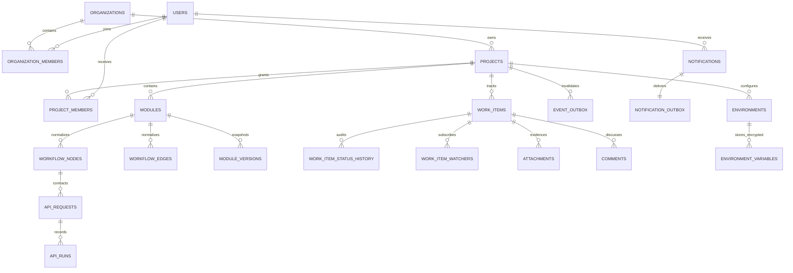

# Flowak architecture and ERD

The Go/Gin runtime is the only production API and serves the built Vite client. PostgreSQL is the only runtime database. Normalized graph records are authoritative. Compatibility writes to `modules.nodes` and `modules.edges` are disabled by default; the legacy read fallback remains for one release and must never supersede normalized data.

## Lifecycle and constraints

- Project membership and organization membership are checked server-side before project resources are read or changed.
- Nodes and edges use soft-delete/row-version behavior; child comments and work items remain intact during graph reconciliation.
- Work-item hierarchy is same-project only and rejects cycles. Status transitions are audited in `work_item_status_history`.
- API runner targets are allowlisted server-side. Environment variable values, raw response bodies, credentials, and cookies are not exposed in derived views, event payloads, or exports.
- Module baselines are immutable. A restore creates a new draft version rather than overwriting history.
- Event/notification outbox entries expire after 30 days; activity expires after 180 days; non-evidence API runs expire after 30 days. Evidence and module baseline retention require an operator decision and are not deleted by the startup pruning job.
