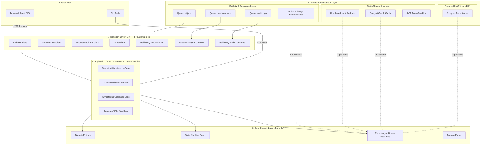

# Arsitektur Backend Flowak: Clean Architecture, Redis, RabbitMQ & Pola 1-Func-Per-File

Dokumen ini memuat cetak biru (*architectural blueprint*) backend Flowak yang telah disempurnakan dengan penambahan **Redis** (Caching & State), **RabbitMQ** (Message Broker & Event-Driven), serta penerapan aturan ketat **1 File = 1 Fungsi** (*Single-Function File Pattern*) untuk mencapai *Clean Code*, *Zero God Files*, dan kemudahan *maintenance* jangka panjang.

---

## 1. Ringkasan Eksekutif & Kebutuhan Baru

Dalam iterasi ini, backend Flowak ditransformasikan untuk mengatasi limitasi arsitektur saat ini dengan 3 pilar utama:
1. **Penerapan Clean Architecture (Hexagonal / Ports & Adapters)**:
   - Memisahkan secara tegas antara **Domain**, **Use Case**, **Repository**, **Infra**, dan **Transport**.
2. **Integrasi Redis & RabbitMQ**:
   - **Redis**: Caching query graf/proyek yang berat, manajemen blacklist JWT token saat logout, rate limiting, dan *distributed lock* untuk operasi graf konkuren.
   - **RabbitMQ**: Mengubah operasi berat (eksekusi AI dan API contract runner) dari yang sebelumnya memblokir HTTP worker menjadi *asynchronous background job*, serta menjadi *message broker* untuk multi-instance real-time SSE event streaming.
3. **Pola 1 File = 1 Fungsi (*Single-Function per File*)**:
   - Menghapus semua file raksasa (*God files* seperti `module_graph.go` 1.178 baris).
   - Setiap berkas `.go` hanya memiliki **satu tanggung jawab dan satu fungsi utama** (misal: `create_work_item.go`, `transition_status.go`, `publish_event.go`).

---

## 2. Diagram Arsitektur Target (Clean Architecture + Redis + RabbitMQ)



---

## 3. Peran & Skenario Penggunaan: Redis & RabbitMQ

### 3.1. Skenario Penggunaan Redis
| Area | Implementasi Redis | Keuntungan |
|---|---|---|
| **Auth & Session** | `blacklist:token:<jti>` dengan TTL sesuai sisa masa aktif JWT | Logout instan dan revokasi sesi tanpa query tabel user di Postgres. |
| **Hot Graph Cache** | `cache:module:<id>:graph` menyimpan JSON struktur nodes & edges | Mengurangi beban deserialisasi Postgres saat ribuan user melihat kanvas bersamaan. |
| **Distributed Lock** | `lock:module:<id>:sync` (TTL 5 detik) menggunakan Redis `SET NX EX` | Mencegah *race condition* saat dua kolaborator menyimpan perubahan graf di detik yang sama. |
| **User Presence** | Redis Hash `presence:module:<id>` mencatat user aktif dengan heartbeat | Mengetahui siapa saja yang sedang membuka modul tanpa membebani database relational. |

### 3.2. Skenario Penggunaan RabbitMQ
| Antrean / Topik | Produser | Konsumen (Worker) | Masalah yang Dipecahkan |
|---|---|---|---|
| **`flowak.ai.jobs`** | `generate_ai_flow.go` | `ai_job_consumer.go` | AI generation (bisa 10–30 detik) tidak lagi memblokir request HTTP. Client mendapat `job_id`, status diproses di background. |
| **`flowak.events.broadcast`** | Setiap usecase mutasi (WorkItem, Graph, Member) | `sse_broadcast_consumer.go` | Memungkinkan SSE streaming bekerja lintas multiple backend server (skalabilitas horizontal). |
| **`flowak.api_runner.jobs`** | `run_api_request.go` | `api_runner_consumer.go` | Eksekusi cURL/HTTP target runner dilakukan secara terisolasi tanpa membebani server web utama. |
| **`flowak.audit.logs`** | Mutasi status kanban & graph baseline | `audit_log_consumer.go` | Penulisan audit trail dilakukan secara async tanpa memperlambat latency user. |

---

## 4. Filosofi Pola "1 File = 1 Fungsi" (*Single-Function File Pattern*)

Aturan ini mengharuskan setiap file `.go` **hanya memiliki satu tujuan utama dan satu fungsi utama yang dieksekusi**.
- Di layer **Handler**: 1 file = 1 endpoint handler (misal `create_work_item_handler.go`).
- Di layer **Use Case**: 1 file = 1 use case function/struct (misal `transition_status_usecase.go`).
- Di layer **Repository Postgres**: 1 file = 1 query/metode repositori (misal `find_work_item_by_key.go`).
- Di layer **Redis**: 1 file = 1 operasi redis (misal `blacklist_token.go`).
- Di layer **RabbitMQ**: 1 file = 1 fungsi publish / 1 fungsi consume (misal `publish_work_item_event.go`).

### Mengapa Pola Ini Sangat Efektif?
1. **Zero Merge Conflict**: Developer yang mengerjakan fitur berbeda pada modul yang sama tidak akan mengalami konflik git karena mengedit file yang berbeda.
2. **Navigasi Cepat**: Mencari bug pada endpoint "transisi status" cukup buka `transition_status_handler.go` dan `transition_status_usecase.go`.
3. **God Files Lenyap**: Tidak ada lagi file 1.000+ baris seperti `module_graph.go`. Setiap file rata-rata berukuran 30–80 baris.
4. **Unit Test Presisi**: Setiap file `foo.go` berpasangan langsung dengan `foo_test.go`.

---

## 5. Cetak Biru Struktur Direktori Baru (Granular 1-Func-Per-File)

Berikut adalah struktur folder lengkap yang mengadopsi Clean Architecture, Redis, RabbitMQ, dan pola 1-Func-Per-File:

```
backend/
├── cmd/
│   ├── server/
│   │   └── main.go                             # Inisialisasi koneksi, DI container, & HTTP server
│   ├── worker/
│   │   └── main.go                             # Worker RabbitMQ terpisah untuk AI & heavy jobs
│   └── graph-reconcile/
│       └── main.go                             # CLI tool rekonsiliasi graf
│
├── config/
│   ├── config.go                               # Struct konfigurasi (PG, Redis, RabbitMQ, JWT)
│   └── load_config.go                          # Fungsi load environment
│
├── internal/
│   ├── domain/                                 # [LAYER 1: DOMAIN ENTITIES & INTERFACES]
│   │   ├── auth/
│   │   │   ├── user_entity.go                  # Struct User
│   │   │   └── errors.go                       # ErrInvalidPassword, ErrUserNotFound
│   │   ├── workitem/
│   │   │   ├── work_item_entity.go             # Struct WorkItem
│   │   │   ├── status_state_machine.go         # Func: CanTransitionStatus(from, to)
│   │   │   ├── work_item_repository.go         # Interface: WorkItemRepository
│   │   │   └── errors.go                       # ErrInvalidTransition, ErrOptimisticLockConflict
│   │   ├── module/
│   │   │   ├── graph_entity.go                 # Struct Node, Edge, Module
│   │   │   ├── cycle_detector.go               # Func: DetectCycles(nodes, edges)
│   │   │   ├── module_repository.go            # Interface: ModuleRepository
│   │   │   └── errors.go                       # ErrGraphConflict, ErrCycleDetected
│   │   └── common/
│   │       ├── cache_repository.go             # Interface: CacheRepository
│   │       ├── lock_repository.go              # Interface: LockRepository
│   │       └── event_publisher.go              # Interface: EventPublisher
│   │
│   ├── usecase/                                # [LAYER 2: USE CASES (1 FUNC PER FILE)]
│   │   ├── auth/
│   │   │   ├── register_user.go                # Func: ExecuteRegisterUser()
│   │   │   ├── login_user.go                   # Func: ExecuteLoginUser()
│   │   │   └── logout_user.go                  # Func: ExecuteLogoutUser()
│   │   ├── workitem/
│   │   │   ├── create_work_item.go             # Func: ExecuteCreateWorkItem()
│   │   │   ├── get_work_item_detail.go         # Func: ExecuteGetWorkItemDetail()
│   │   │   ├── transition_work_item.go         # Func: ExecuteTransitionWorkItem()
│   │   │   └── update_work_item.go             # Func: ExecuteUpdateWorkItem()
│   │   ├── module/
│   │   │   ├── sync_module_graph.go            # Func: ExecuteSyncModuleGraph()
│   │   │   ├── get_module_graph.go             # Func: ExecuteGetModuleGraph() (cek Redis -> fallback PG)
│   │   │   ├── publish_baseline.go             # Func: ExecutePublishBaseline()
│   │   │   └── reconcile_graph.go              # Func: ExecuteReconcileGraph() (bisa dipanggil CLI & HTTP)
│   │   └── ai/
│   │       ├── enqueue_generate_flow.go        # Func: ExecuteEnqueueAIGenerate()
│   │       └── process_ai_job.go               # Func: ExecuteProcessAIJob() (konsumen RabbitMQ)
│   │
│   ├── repository/                             # [LAYER 3: DATA ACCESS IMPLEMENTATIONS]
│   │   ├── postgres/
│   │   │   ├── connection.go                   # Func: NewPostgresConnection()
│   │   │   ├── tx_manager.go                   # Func: RunInTransaction()
│   │   │   ├── workitem/
│   │   │   │   ├── find_by_key.go              # Func: FindByKey(ctx, key)
│   │   │   │   ├── insert_work_item.go         # Func: Insert(ctx, item)
│   │   │   │   ├── update_status.go            # Func: UpdateStatus(ctx, id, status, version)
│   │   │   │   └── list_by_project.go          # Func: ListByProject(ctx, filter)
│   │   │   └── module/
│   │   │       ├── find_by_id.go               # Func: FindByID(ctx, id)
│   │   │       ├── upsert_nodes.go             # Func: UpsertNodes(ctx, nodes)
│   │   │       └── delete_nodes.go             # Func: DeleteNodes(ctx, nodeIDs)
│   │   │
│   │   └── redis/
│   │       ├── connection.go                   # Func: NewRedisClient()
│   │       ├── cache/
│   │       │   ├── get_graph_cache.go          # Func: GetGraphCache(ctx, moduleID)
│   │       │   ├── set_graph_cache.go          # Func: SetGraphCache(ctx, moduleID, graph, ttl)
│   │       │   └── invalidate_graph_cache.go   # Func: InvalidateGraphCache(ctx, moduleID)
│   │       ├── lock/
│   │       │   ├── acquire_lock.go             # Func: AcquireLock(ctx, key, ttl)
│   │       │   └── release_lock.go             # Func: ReleaseLock(ctx, key)
│   │       └── session/
│   │           ├── blacklist_token.go          # Func: BlacklistToken(ctx, tokenID, ttl)
│   │           └── is_token_blacklisted.go     # Func: IsTokenBlacklisted(ctx, tokenID)
│   │
│   ├── infra/                                  # [LAYER 3: EXTERNAL ADAPTERS & BROKER]
│   │   ├── rabbitmq/
│   │   │   ├── connection.go                   # Func: NewRabbitMQConnection()
│   │   │   ├── setup_topology.go               # Func: SetupExchangesAndQueues()
│   │   │   ├── producer/
│   │   │   │   ├── publish_event.go            # Func: PublishEvent(ctx, routingKey, payload)
│   │   │   │   └── publish_ai_job.go           # Func: PublishAIJob(ctx, job)
│   │   │   └── consumer/
│   │   │       ├── consume_ai_jobs.go          # Func: ConsumeAIJobs(ctx, handler)
│   │   │       ├── consume_sse_broadcast.go    # Func: ConsumeSSEBroadcast(ctx, hub)
│   │   │       └── consume_audit_logs.go       # Func: ConsumeAuditLogs(ctx, repo)
│   │   ├── ai/
│   │   │   └── call_gemini.go                  # Func: CallGeminiAPI(ctx, prompt)
│   │   └── security/
│   │       ├── generate_jwt.go                 # Func: GenerateJWT(user)
│   │       └── hash_password.go                # Func: HashPassword(password)
│   │
│   └── transport/                              # [LAYER 4: DELIVERY / GIN HTTP]
│       └── http/
│           ├── router.go                       # Func: RegisterRoutes(engine, handlers)
│           ├── response/
│           │   ├── write_success.go            # Func: WriteSuccess(c, data)
│           │   ├── write_error.go              # Func: WriteError(c, err)
│           │   └── write_validation_error.go   # Func: WriteValidationError(c, message)
│           ├── middleware/
│           │   ├── auth_middleware.go          # Func: AuthMiddleware(jwtService, redisSession)
│           │   ├── cors_middleware.go          # Func: CORSMiddleware()
│           │   └── rbac_middleware.go          # Func: RequireProjectRole(role)
│           └── handler/
│               ├── auth/
│               │   ├── handle_register.go      # Func: HandleRegister(c)
│               │   ├── handle_login.go         # Func: HandleLogin(c)
│               │   └── handle_logout.go        # Func: HandleLogout(c)
│               └── workitem/
│                   ├── handle_create.go        # Func: HandleCreateWorkItem(c)
│                   ├── handle_get_detail.go    # Func: HandleGetWorkItemDetail(c)
│                   └── handle_transition.go    # Func: HandleTransitionWorkItem(c)
│
├── db/
│   └── migrations/                             # File migrasi SQL PostgreSQL
│
├── go.mod
└── go.sum
```

---

## 6. Contoh Implementasi Kode (Pola 1-Func-Per-File)

### 6.1. Use Case: `transition_work_item.go` (1 Fungsi)
```go
package workitem

import (
    "context"
    "backend/internal/domain/workitem"
)

type TransitionWorkItemUseCase struct {
    repo      workitem.WorkItemRepository
    lock      workitem.LockRepository
    publisher workitem.EventPublisher
}

func NewTransitionWorkItemUseCase(repo workitem.WorkItemRepository, lock workitem.LockRepository, pub workitem.EventPublisher) *TransitionWorkItemUseCase {
    return &TransitionWorkItemUseCase{repo: repo, lock: lock, publisher: pub}
}

// ExecuteTransitionWorkItem hanya memiliki 1 fungsi utama ini
func (uc *TransitionWorkItemUseCase) Execute(ctx context.Context, actorID, key string, targetStatus workitem.Status, rowVersion int, note string) (*workitem.WorkItem, error) {
    // 1. Ambil distributed lock di Redis agar aman dari request ganda
    lockKey := "lock:workitem:" + key
    if err := uc.lock.Acquire(ctx, lockKey, 5); err != nil {
        return nil, workitem.ErrConcurrentUpdate
    }
    defer uc.lock.Release(ctx, lockKey)

    // 2. Ambil data item dari database
    item, err := uc.repo.FindByKey(ctx, key)
    if err != nil {
        return nil, err
    }

    // 3. Validasi aturan domain state-machine
    if !workitem.CanTransitionStatus(item.Status, targetStatus) {
        return nil, workitem.ErrInvalidStatusTransition
    }

    // 4. Update data dengan optimistic locking
    updated, err := uc.repo.UpdateStatus(ctx, item.ID, targetStatus, rowVersion, note)
    if err != nil {
        return nil, err
    }

    // 5. Publikasikan event ke RabbitMQ (Async notification & SSE)
    _ = uc.publisher.PublishEvent(ctx, "workitem.transitioned", updated)

    return updated, nil
}
```

### 6.2. Redis Repo: `blacklist_token.go` (1 Fungsi)
```go
package session

import (
    "context"
    "time"
    "github.com/redis/go-redis/v9"
)

type BlacklistTokenRepo struct {
    client *redis.Client
}

func NewBlacklistTokenRepo(client *redis.Client) *BlacklistTokenRepo {
    return &BlacklistTokenRepo{client: client}
}

// BlacklistToken menyimpan token ID ke Redis dengan TTL sisa masa berlaku JWT
func (r *BlacklistTokenRepo) BlacklistToken(ctx context.Context, tokenID string, remainingTTL time.Duration) error {
    key := "blacklist:token:" + tokenID
    return r.client.Set(ctx, key, "revoked", remainingTTL).Err()
}
```

### 6.3. RabbitMQ Producer: `publish_event.go` (1 Fungsi)
```go
package producer

import (
    "context"
    "encoding/json"
    amqp "github.com/rabbitmq/amqp091-go"
)

type RabbitEventPublisher struct {
    channel  *amqp.Channel
    exchange string
}

func NewRabbitEventPublisher(ch *amqp.Channel, exchange string) *RabbitEventPublisher {
    return &RabbitEventPublisher{channel: ch, exchange: exchange}
}

// PublishEvent mengirim pesan ke topic exchange RabbitMQ
func (p *RabbitEventPublisher) PublishEvent(ctx context.Context, routingKey string, payload any) error {
    body, err := json.Marshal(payload)
    if err != nil {
        return err
    }

    return p.channel.PublishWithContext(ctx,
        p.exchange,
        routingKey,
        false,
        false,
        amqp.Publishing{
            ContentType: "application/json",
            Body:        body,
        },
    )
}
```

### 6.4. HTTP Handler: `handle_transition.go` (1 Fungsi)
```go
package workitem

import (
    "backend/internal/transport/http/middleware"
    "backend/internal/transport/http/response"
    "backend/internal/usecase/workitem"
    "github.com/gin-gonic/gin"
)

type TransitionHandler struct {
    useCase *workitem.TransitionWorkItemUseCase
}

func NewTransitionHandler(uc *workitem.TransitionWorkItemUseCase) *TransitionHandler {
    return &TransitionHandler{useCase: uc}
}

// Handle hanya mem-parse HTTP input dan meneruskan ke UseCase
func (h *TransitionHandler) Handle(c *gin.Context) {
    userID := middleware.MustGetUserID(c)
    key := c.Param("key")

    var req struct {
        Status     string `json:"status" binding:"required"`
        RowVersion int    `json:"row_version" binding:"required"`
        Note       string `json:"note"`
    }
    if err := c.ShouldBindJSON(&req); err != nil {
        response.WriteValidationError(c, "Invalid request body")
        return
    }

    item, err := h.useCase.Execute(c.Request.Context(), userID, key, req.Status, req.RowVersion, req.Note)
    if err != nil {
        response.WriteError(c, err)
        return
    }

    response.WriteSuccess(c, item)
}
```

---

## 7. Rencana Migrasi Bertahap (Non-Breaking)

| Langkah | Sasaran Pekerjaan | Deliverable |
|---|---|---|
| **Langkah 1: Setup Infrastruktur (Redis & RabbitMQ)** | Konfigurasi koneksi `internal/repository/redis` dan `internal/infra/rabbitmq`. | Package Redis client & RabbitMQ publisher teruji via ping. |
| **Langkah 2: Standardisasi Response & Domain Errors** | Buat `internal/transport/http/response` (1-func-per-file) untuk respon sukses dan mapping domain error ke HTTP status. | Error format seragam, tidak ada lagi string error acak di handler. |
| **Langkah 3: Migrasi Modul Auth & Session** | Pindahkan register, login, dan logout ke struktur baru. Tambahkan JWT blacklisting via Redis pada `logout`. | `auth` terpisah menjadi file-file kecil dan token revokasi bekerja. |
| **Langkah 4: Migrasi Work Items & Event Publishing** | Pecah `work_items.go` (781 baris) menjadi file 1-func. Integrasikan RabbitMQ untuk notifikasi dan transisi status. | Kanban use cases terisolasi rapi, SSE events dialirkan via RabbitMQ. |
| **Langkah 5: Dekomposisi Graph & Integrasi Cache Redis** | Pecah `module_graph.go` (1.178 baris) menjadi unit-unit kecil (`cycle_detector`, `upsert_nodes`, `sync_graph`). Terapkan Redis cache untuk query graf. | Bebas god-file, waktu load kanvas naik drastis berkat Redis caching. |
| **Langkah 6: Worker RabbitMQ untuk AI & API Runner** | Pisahkan eksekusi Gemini AI dan API runner ke `cmd/worker/main.go` yang mengonsumsi antrean RabbitMQ. | Server HTTP tidak lagi mengalami timeout saat memproses prompt AI panjang. |

---

## 8. Kesimpulan

Dengan mengombinasikan:
1. **Clean Architecture** (Inversi dependensi, kemudahan pengujian).
2. **Redis** (Kecepatan cache, distributed lock, logout instan).
3. **RabbitMQ** (Beban berat tidak memblokir HTTP, event streaming lintas instance).
4. **1 File = 1 Fungsi** (Kemudahan membaca kode, tidak ada god files, zero merge conflicts).

Backend Flowak akan menjadi sistem bertaraf *enterprise-grade* yang sangat kokoh, bersih (*clean code*), dan siap untuk ekspansi fitur di masa mendatang.
